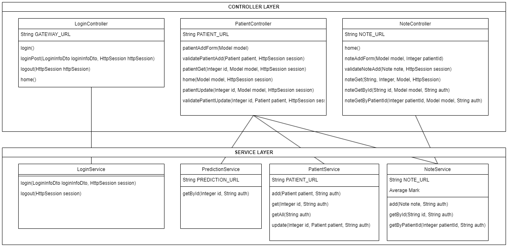

# OC_DA_JAVA_P9_Front

Front-end microservice for [medilabo](https://github.com/SimonArduin/OC_DA_JAVA_P9_Medilabo)

This application allows users to interact with the medilabo services through a web browser. It displays html pages and makes request to the other microservices through the gateway microservice.

It is built with Spring as a Gradle project, using the following modules :
- Thymeleaf

The application configuration is defined in [application.properties](front/src/main/resources/application.properties). By default, incoming requests are received on port 8080, and the requests to the gateway are sent to localhost:8010.

***
# CLASS DIAGRAM

